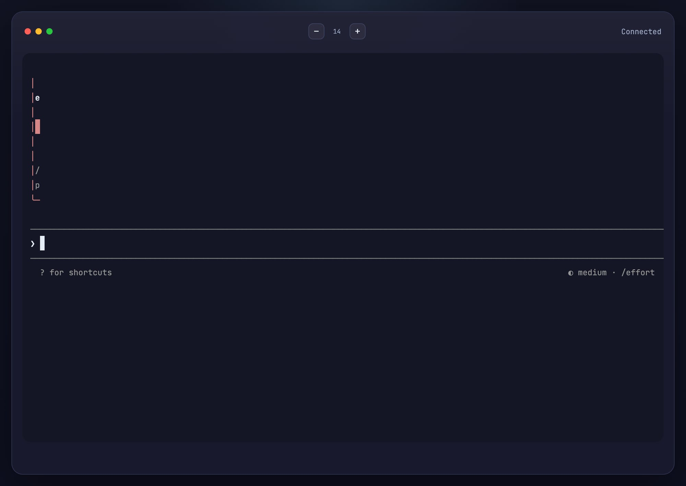
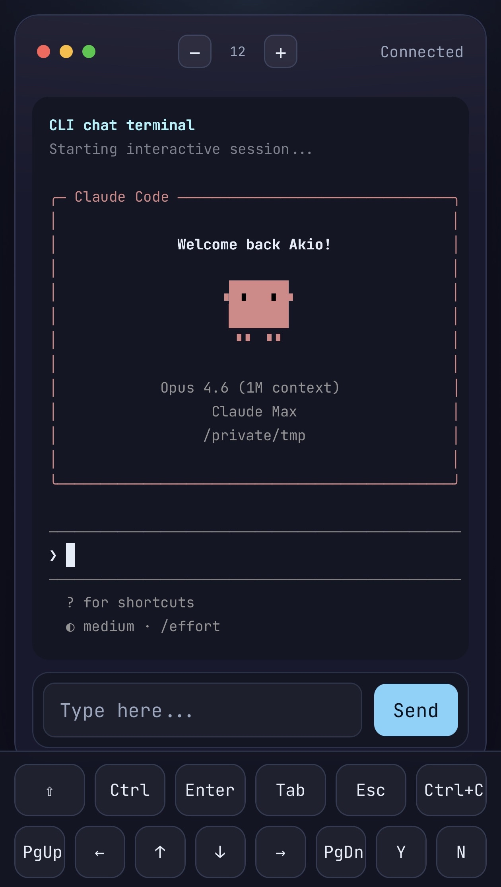

# embed-terminal

Embeddable web terminal server for any directory.

## Screenshots

### PC



### Mobile



## Features

- **xterm.js** — full terminal emulation in the browser
- **node-pty** — real PTY backend via WebSocket
- **Session management** — automatic reconnection with output replay
- **IME support** — works with CJK input methods
- **Mobile support** — 画面幅768px以下でコントロールバーが自動表示。Ctrl/Shift/Tab/Esc/Enter/矢印キー等のボタンが使える。ダブルタップでロック固定可能
- **Theme presets** — dark, light, monokai, dracula (or custom)

## Quick Start

```bash
npx embed-terminal
npx embed-terminal --cwd /path/to/project --port 8080
```

By default, your login shell (`$SHELL`, e.g. bash or zsh) is launched. Opens a browser terminal at `http://0.0.0.0:3456`.

## CLI Options

| Option | Default | Description |
|---|---|---|
| `--cwd <path>` | `process.cwd()` | Working directory for the terminal |
| `--port <number>` | `3456` | Server port |
| `--host <address>` | `0.0.0.0` | Server host |

```bash
npx embed-terminal --cwd ~/projects/myapp --port 8080
```

## Library Usage (Server)

```js
const http = require('http');
const { createChatServer } = require('embed-terminal');

const server = http.createServer();

const chat = createChatServer(server, {
  cwd: '/path/to/project',
  path: '/ws',
  getCommandAndArgs: (searchParams) => ({
    command: 'claude',
    args: [],
  }),
  onSessionCreated: ({ pid, searchParams }) => {
    console.log(`PTY started: pid=${pid}`);
  },
});

server.listen(3000);

// Cleanup:
// await chat.close();
```

`createChatServer(server, options)` returns `{ wss, sessions, close }`.

### Server Options

| Option | Description |
|---|---|
| `cwd` | Working directory for the terminal |
| `path` | WebSocket endpoint path |
| `getCommandAndArgs(searchParams)` | Callback that receives URL query parameters (`URLSearchParams`) and returns `{ command, args }`. If omitted, `$SHELL` is launched |
| `onSessionCreated({ pid, searchParams })` | Callback invoked after the PTY process starts. Receives the process ID and URL query parameters |

## Library Usage (Client)

```html
<div id="terminal"></div>
<script src="/node_modules/embed-terminal/src/client.js"></script>
<script>
  const term = new ChatTerminal(document.getElementById('terminal'), {
    wsUrl: 'ws://localhost:3000/ws',
    fontSize: 14,
    theme: 'dark',
  });

  term.onExit = function (event) {
    console.log('exited with code', event.code);
  };
</script>
```

### Client Options

| Option | Default | Description |
|---|---|---|
| `wsUrl` | auto-detected | WebSocket URL |
| `fontSize` | `14` | Terminal font size |
| `fontFamily` | `"JetBrains Mono", monospace` | Terminal font |
| `theme` | `'default'` | Theme name or custom object |

### Client Methods

- `connect()` — connect to the server
- `dispose()` — close connection and clean up
- `fit()` — resize terminal to fit container
- `resize(cols, rows)` — set explicit terminal size
- `sendInput(text)` — send text to the PTY
- `setFontSize(size)` — change font size
- `setTheme(theme)` — change theme (name or object)
- `setInputTransformer(fn)` — transform input before sending

## Mobile Support

On screens narrower than 768px, a control bar is automatically displayed at the bottom of the terminal.

**Available buttons:** Ctrl, Shift, Tab, Esc, Enter, ↑↓←→ (arrow keys)

**Lock mode:** Double-tap a modifier button (Ctrl, Shift) to lock it on. Tap again to unlock.


## Requirements

- Node.js 18+

## License

MIT
